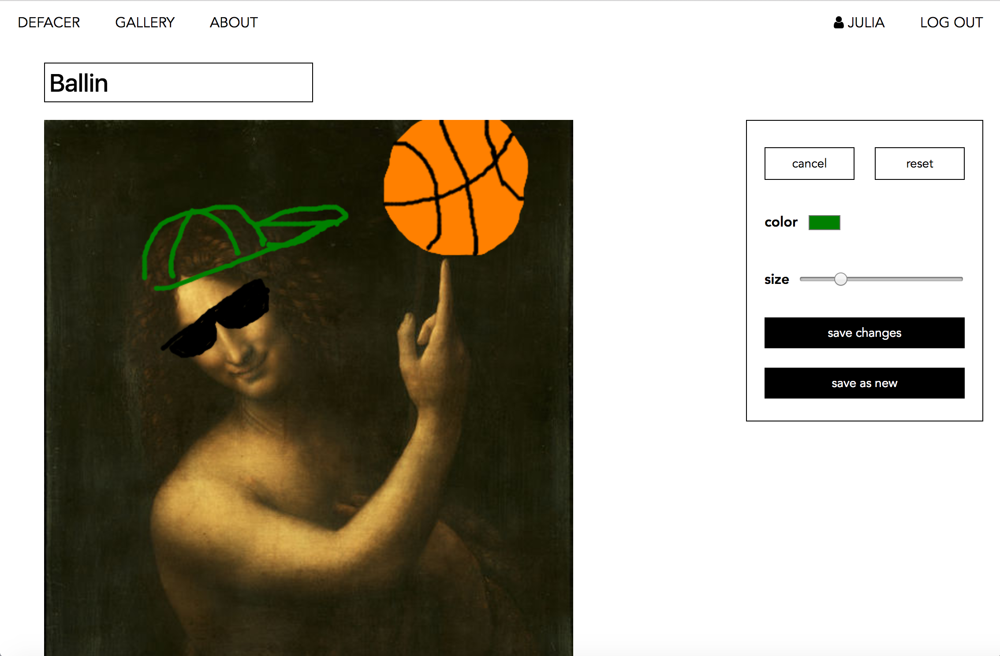

# Defacer

## Technologies Used
- React
- Express
- React-Sketchpad
- Express Authentication
- Artsy.net API

## Approach

## Installation
From the root directory in the terminal:
Run `npm install` to install all of the backend dependencies.
Run `cd client` and then `yarn install` to install the frontend dependencies.

## User Stories

## Wireframes

## Unsolved Problems and Major Hurdles