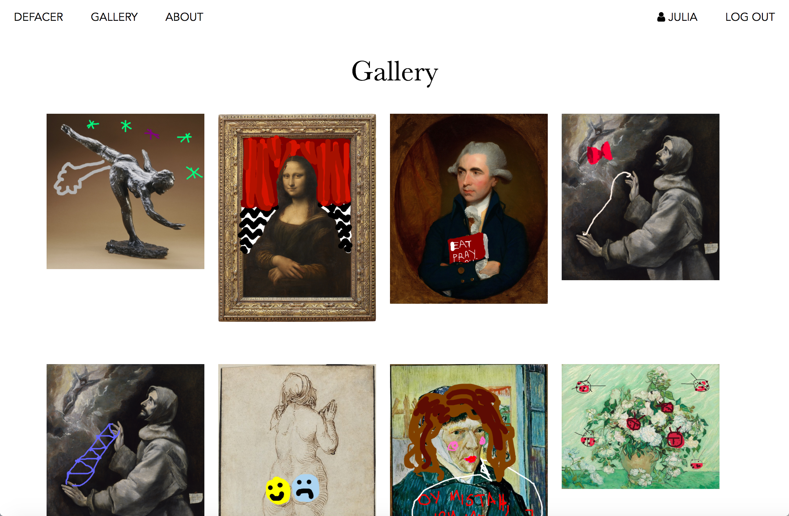

# Defacer

[Heroku Link](https://defacer.herokuapp.com)

## Technologies Used
- React
- Express
- React-Sketchpad
- React-Router
- Express Authentication
- Artsy.net API

## Approach
I started this project by first setting up the basic structure of the backend and creating routes to incorporate data from the Artsy API about artists and their respective artworks. 
After that, I worked on the frontend in react. First, I set up the home component so that the user can select a painting from the to eventually sketch over. The Artsy API doesn't have artist data on their `/artists` endpoint, so you have to get artist data by passing a specific artist a param, `/artists/pablo-picasso`, and artworks are obtained by fetching `/artists/pablo-picasso/works`. Since the API only includes artworks that have image sources that are in the public domain, I had to search their API for specific artists and make sure they had artworks with images I could use (many artists show up in the database but do not have any available works). 

## Installation
From the root directory in the terminal:
Run `npm install` to install all of the backend dependencies.
Run `cd client` and then `yarn install` to install the frontend dependencies.

## User Stories
When the user is on the home page, they select an artist. When an artist is selected, the user can select on of their paintings to 'deface' or 

## Wireframes

## Unsolved Problems and Major Hurdles
I struggled a lot with authentication and tried a couple of different approaches before finally figuring out how to do it in the straightfoward, more intuitive way that I had originally planned on doing. 
